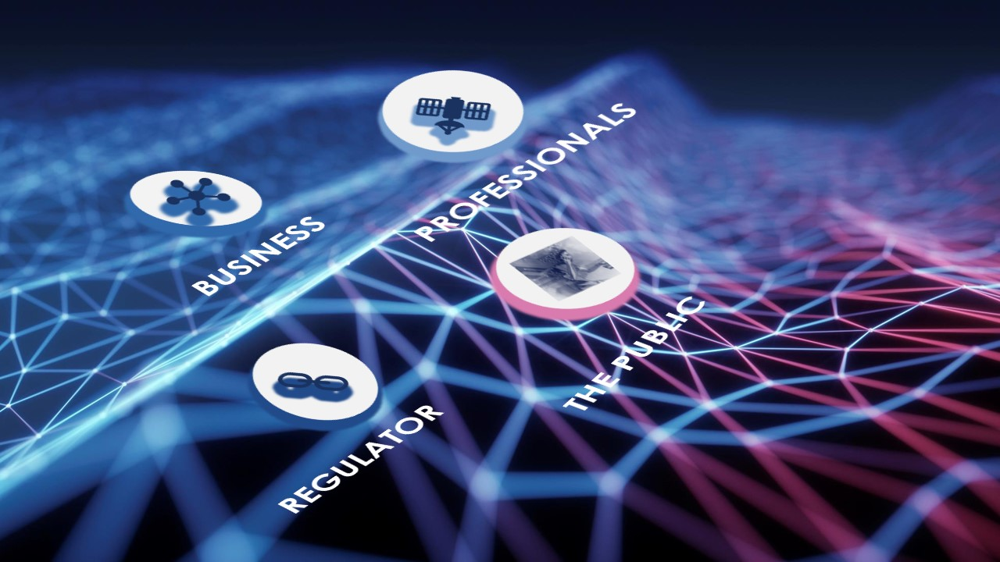

I started a company some years ago intending to act as a conduit between entities that work together in a symbiosis relation. In my opinion, these four entities are:

* the public
* the business
* professionals
* the regulator/government.

I have had prior exposure and training with Radio Spectrum Management in my first job in New Zealand working for Spark. It is here that I saw this gap that I wanted to address. Only when I joined Radio Spectrum Management, I quickly realized how deep the rabbit hole goes and that I have only scratched the surface. There are so many other radio licenced services that are crucial to effectively allowing access to the radio spectrum for New Zealanders. We find details of this services in the Public Information Brochure [PIB 38](https://www.rsm.govt.nz/assets/Uploads/documents/pibs/3eadde74f8/radio-licence-certification-rules-pib-38.pdf)
- Fixed services
- Land Mobile services
- Fixed Satellite services
- Aeronautical services
- Maritime services
- Other services:
    - Radio Paging;
    - Telemetry / Telecommand; and
    - Personal Radio Service Repeaters.
- Meteorological aids
- Radiodetermination:
    - Radionavigation
    - Radiolocation; and
- Services under 30 MHz

Thus Spectrum Efficiency was incorporated:

Due to conflict of interests, I never pursued the dream of owning a company. I kept the name and it stands for:

> How efficient are you in delivering a specific communication given that you only have a certain amount of time to do it.

The values that it is built on are

## Professionalism

* I want to share thoughts and have opinions about various topics within the telecommunications industry.
* Uses widely deployed and trusted tools.
* Includes comprehensive data science capabilities.
* Offers flexibility through the use of code repository.
* Provides transparency through visualizations and code repository.

## Accuracy 

* I want to always base my opinions on facts and provide a reproducible report. 
* Employs existing knowledge and analytic investments.
* Allows rapid development and iteration.
* Scales well for enterprise and production use.
* Empowers your business stakeholders.

## Optimized

* I want to provide the easiest most efficient way to consume this information. 
* Provides reusable, reproducible code and results.
* Delivers relevant, up-to-date insights.
* Supports and is supported by a vital open source community.
* Avoids vendor lock-in.

## Community

Give back to the community that helped me become the professional I am today. In the form of tools that progress the telecommunication community closer to data science community. I base this on the framework open by design

Learn more and contribute on [GitHub](https://github.com/StoianAndrei/spectrumefficiency)